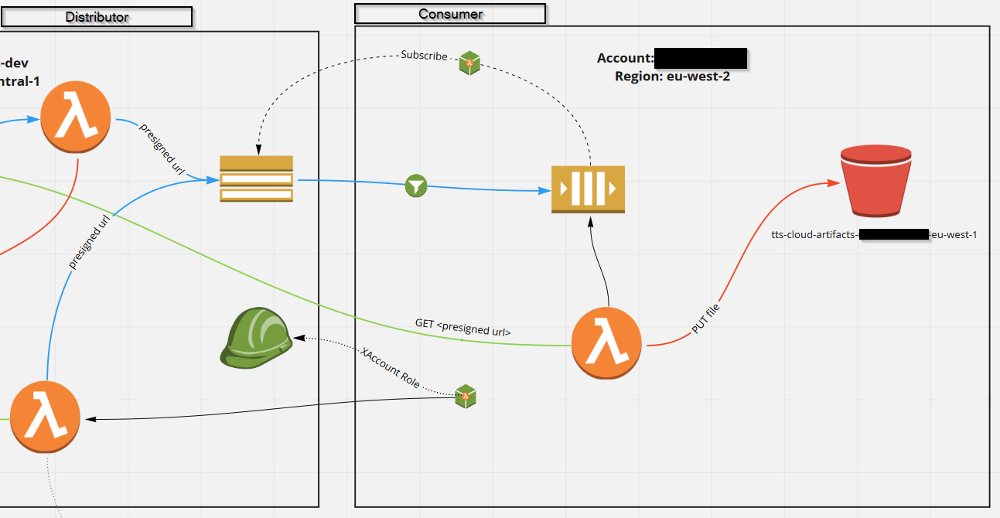

# Build Artifact Consumer

This is a Cloudformation project 
providing a stack which subscribes do an artifact distribution stack.

## Requirements

* AWS CLI already configured
* [AWS SAM installed](https://docs.aws.amazon.com/serverless-application-model/latest/developerguide/serverless-sam-cli-install.html)
* [Python 3 installed](https://www.python.org/downloads/)
* [pipenv installed](https://pipenv.readthedocs.io/en/latest/)
* [pyenv installed](https://github.com/pyenv/pyenv-installer) (optional)

## Setup process

Before you get started, create an empty `.venv` directory, which will contain the project's virtual python environment.
The `pipenv install -d` command should already work correctly (without the `.venv` directory, it will create the virtual environment somewhere
in your user directory), but the `sam build` command should not work, since the template file is empty.

The Lambda functions are written in Python and the Python package management is done via *pipenv*.
The dependency descriptions are maintained in the *Pipfile*.
To create an environment for the project, run
```bash
pipenv install -d
```
which will create a virtual Python environment for your project, as well as a `Pipfile.lock` file, which
should be versioned.
To create the environment in the project directory, create a *.venv* directory before executing the command
(As another possibility, set the `PIPENV_VENV_IN_PROJECT=true` environment variable).

In IntelliJ, set the Project SDK home path to `.venv/Scripts/python.exe`, to use the created environment.

### Create a Bamboo Build Plan

To create a Bamboo Build Plan for this project, take the plan specification from
`specs/bamboo-plan-template.yaml` along with the placeholders and execute the *Bamboo Specs Builder*
with these files.

### Building the project with SAM

To build the project using AWS SAM, simply run
```bash
sam build
```
which will create a `.aws-sam` directory containing the generated files.

## Packaging and deployment

To deploy the template as it is, run

```bash
aws cloudformation package \
    --template-file template.yaml \
    --s3-bucket ${TEMPLATES_BUCKET} \
    --s3-prefix ${TEMPLATES_PREFIX} \
    --output json > ${OUTPUT_TEMPLATE_NAME}    
```

The reason why this project has the Lambda code defined inside the template
is, that in this way it is possible to deploy the stack via StackSets without having 
the Lambda code available in the target region or account.

### Using SAM
To deploy the generated stack template to an *s3* bucket using SAM, run

```bash
sam package \
    --template-file template.yaml \
    --output-template-file ${OUTPUT_TEMPLATE_NAME} \
    --s3-bucket ${TEMPLATES_BUCKET} \
    --s3-prefix ${TEMPLATES_PREFIX}
```

which will also put the referenced Lambda code to the provided S3 bucket and
create references instead of the code inside the template.


### AWS Toolkit Plugin

When using *PyCharm* or *IntelliJ*, you can use the *AWS Toolkit* Plugin to
create or update a stack. After the installation, you should be able to see a
`Deploy Serverless Application` option when right-clicking on the `template.yaml` file.

You can choose the stack to be updated, if existent, and the parameters as well as the 
S3 bucket the `packaged.yaml` should be deployed to.\

**Note**: It may take some time until the available stacks are loaded
(Make sure you have selected the correct region in the bottom left corner of the IDE).

## General Architecture

The major part of a build-artifact-consumer stack consists of a queue, a lambda and a S3 bucket.
The queue is given a subscription to the build-artifact-distributor topic, which sends
a message each time a new build artifact is available.
Furthermore, the subscription contains a filter for the *account* and *region* the stack resides in,
such that the queue only receives messages which are sent to its explicit stack, or 
to all subscribed consumers.
 
The *copy_files*-Lambda then processes the message, extracting the presigned url the the
distributed object, and copies the file to the target path in the artifact bucket on consumer side.

The second part contains a custom resource and an associated Lambda.
These resources are used to trigger the stepfunctions on distributor side which 
distribute the initial set of build artifacts to any new consumer.
For this, the Lambda assumes a cross-account role defined in the distributor stack.

To allow the consumer stack to establish the subscription between the queue and the distributor topic
as well as the Lambda to assume the cross-account role, the account in which the 
consumer stack is set up must be enlisted as a *trusted account* on the distributor side.



## Usage

The template is built as a pure Cloudformation template, without referencing other resources.
Because of this, it is possible to deploy a stack based on the template directly, without having
packaged or zipped Lambda Code.

### Parameters

The following parameters must be configured:\

* `DistributionTopic`:\
   The distributor topic announcing new files to copy.\
   *Default*: "arn:aws:sns:eu-west-1:529985782713:build-artifact-distributor-DistributionTopic-1A5L07HYRFVRA"
* `DistributionRegion`:\
   The region where the distributor stack is located.\
   *Default*: "eu-west-1"
* `DistributionBucket`:\
   The source bucket of the distribution.\
   *Default*: tts-cloud-artifacts-529985782713-eu-west-1
* `InitialDistributionRole`:\
   The role in the distributor stack account to assume for triggering the initset distribution.\
   *Default*: "arn:aws:iam::529985782713:role/TriggerInitSetRole"
* `InitialDistributionSetMachine`:\
   The state machine to trigger for distributing the initset.\
   *Default*: "arn:aws:states:eu-west-1:529985782713:stateMachine:InitSetRetrieverMachine-i1BYUlZbD1Si"
* `TargetBucket`:\
   Name of an existing bucket in the target account to specify as the bucket to copy the artifacts to.
   If the parameter is left empty, a new bucket with the name tts-cloud-artifacts-${AWS::AccountId}-${AWS::Region}
   is created and used as the target bucket.\
   *Default*: "!NO_VALUE" (This is a workaround du to a problematic behaviour of the boto3 library with empty parameter values.)

Essentially, a distributor stack has to selected to use for the consumer stack. From this distributor
stack, all above parameter values must be copied.

After deployment, the initial set will be transferred to the consumer bucket which is then ready to use.

### Stack Deletion

When a Artifact Consumer stack is deleted, the bucket and its objects are retained.
This leads to a conflict, if the stack should be created again in the same region at a later point.
To resolve this, configure the `TargetBucket` parameter value to match the name of the existing bucket,
in the default case, this is *tts-cloud-artifacts-${AWS::AccountId}-${AWS::Region}*, where
${AWS::AccountId} and ${AWS::Region} must be replaced with the respective values of the target account and region.

## Testing

### Quick test execution

In the Pipfile, the execution is defined as a script
```
[scripts]
tests = "python -m pytest --disable-pytest-warnings"
``` 
which can simply be executed via the command line:
```bash
pipenv run tests
```

### Detailed description of test execution

To execute the tests in an adjusted way, the execution is explained in more detail below. 
One can activate the shell for the Python environment within the project
```bash
pipenv shell
```
and run the `pytest` module
```bash
python -m pytest
```
Or one can invoke the execution directly:
```bash
pipenv run python -m pytest
```
If warnings from imported packages are deranging the output, one can add `--disable-pytest-warnings`.:
```bash
pipenv run python -m pytest --disable-pytest-warnings
```
To create test results resembling jUnit test results, add `--junitxml=test-reports/pytest-results.xml`.
